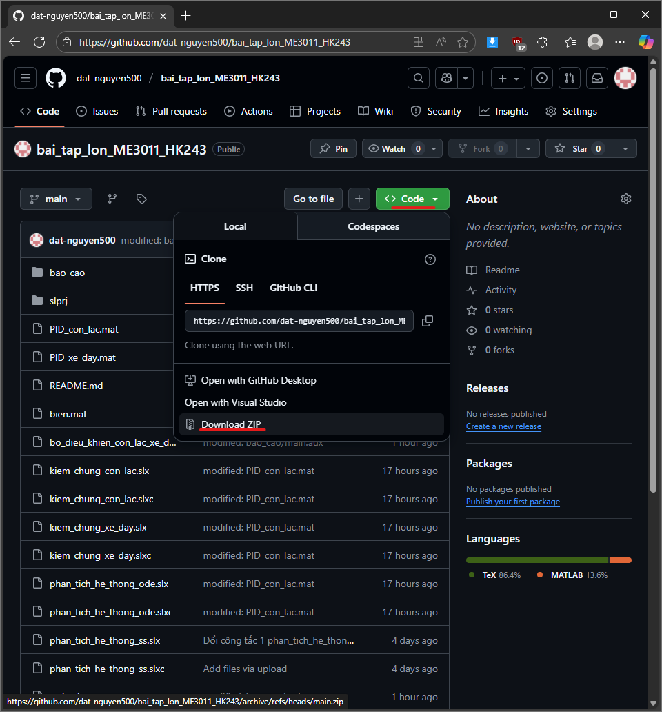
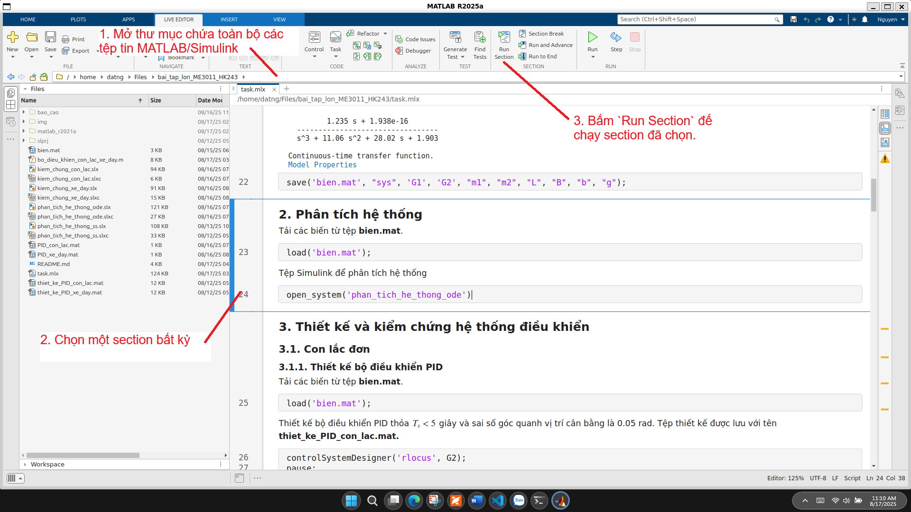
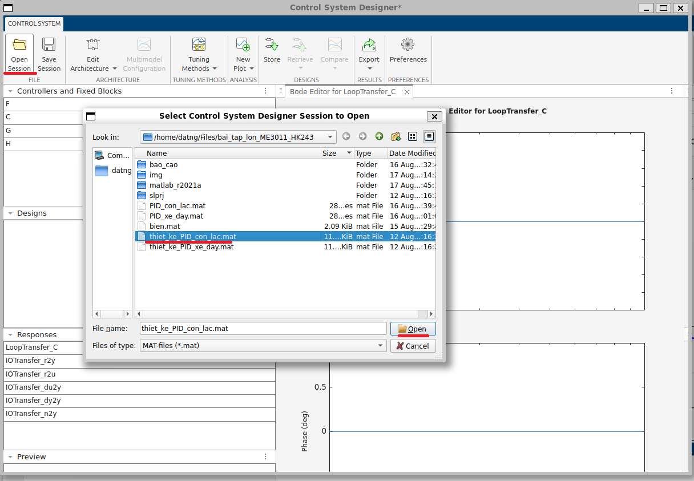

# Bài tập lớn Động lực học & Điều khiển (ME3011) - Học kỳ 243 - Lớp DT01

Đây là là kho lưu trữ các đoạn mã, sơ đồ, báo cáo được hình thành trong quá trình làm bài tập lớn môn Động lực học & Điều khiển (ME3011) - Học kỳ 243 - Lớp DT01.

## Sinh viên thực hiện

| STT | Họ và tên         | Mã số sinh viên | Nhiệm vụ |
| --- | ----------------- | --------------- | -------- |
| 1   | Nguyễn Đức Đạt    | 2111009         | Viết báo cáo, thiết kế các bộ điều khiển         |
| 2   | Trần Quang Đạo    | 2210647                | Thiết kế các bộ điều khiển, lập trình MATLAB/Simulink         |
| 3   | Thành viên bí mật | XXXXXX2         | Cung cấp chữ số cuối MSSV |


## Nội dung các tệp tin

Các tệp tin được chia làm 2 phần
- Phần báo cáo được soạn bằng LaTeX nằm trong thư mục `bao_cao`.
- Phần các tệp tin được xuất ra từ MATLAB/Simulink gồm các tệp đuôi `.m`, `.mlx`, `.mat`, `.slx` và các tệp tin khác.
    - Tệp `task.mlx` chứa các lệnh thực thi chính của bài tập lớn.
    - Tệp `bo_dieu_khien_con_lac_xe_day.m` là hàm để thiết kế bộ điều khiển không gian trạng thái và hiển thị các thông số đáp ứng của bộ điều khiển.
    - Tệp `bien.mat` chứa các hằng số, hàm truyền và không gian trạng thái của đề bài.
    - Tệp `PID_con_lac.mat` chứa các hệ số PID của bộ điều khiển con lắc.
    - Tệp `PID_xe_day.mat` chứa các hệ số PID của bộ điều khiển xe đẩy.
    - Tệp `thiet_ke_PID_con_lac.mat` là quá trình thiết kế bộ điều khiển PID con lắc bằng phương pháp quỹ đạo nghiệm số.
    - Tệp `thiet_ke_PID_xe_day.mat` là quá trình thiết kế bộ điều khiển PID xe đẩy bằng phương pháp quỹ đạo nghiệm số.
    - Tệp `phan_tich_he_thong_ode.slx` được dùng để phân tích hệ thống xe đẩ-con lắc, chỉ được dùng bên trong tệp `task.mlx`.
    - Tệp `kiem_chung_con_lac.slx` được dùng để kiểm chứng bộ điều khiển PID hệ thống con lắc và xem đáp ứng của xe đẩy, chỉ được dùng bên trong tệp `task.mlx`.
    - Tệp `kiem_chung_xe_day.slx` được dùng để kiểm chứng bộ điều khiển PID hệ thống xe đẩy và xem đáp ứng của con lắc, chỉ được dùng bên trong tệp `task.mlx`.


***Lưu ý*** Các tệp tin được xuất ra từ MATLAB/Simulink R2025a. Phiên bản của các tệp tin này cho MATLAB/Simulink R2021a nằm trong thư mục `matlab_r2021a`.

## Hướng dẫn sử dụng

### Tải toàn bộ kho lưu trữ về máy
Để có thể tải toàn bộ kho lưu trữ này về máy, bấm `Code` (màu xanh lá) rồi chọn 
`Download ZIP`.



### MATLAB/Simulink

Các bước để có thể chạy các tệp tin MATLAB/Simulink:

1. Mở thư mục chứa toàn bộ các tệp tin MATLAB/Simulink của bài tập lớn này.
2. Mở tệp tin `task.mlx`.
3. Chọn một section bất kỳ (được ngăn cách với nhau qua các đường gạch ngang) và nhấn `Run Section`.



### Về các tệp tin quá trình thiết kế bộ điều khiển PID

Có 2 tệp tin là `thiet_ke_PID_con_lac.mat` và `thiet_ke_PID_xe_day.mat` chứa quá trình thiết kế bộ điều khiển PID của con lắc và xe đẩy. Các bước để xem 2 tệp này như sau
1. Chạy lệnh sau trong MATLAB Terminal
```MATLAB
controlSystemDesigner
```
2. Cửa sổ Control System Designer hiện ra và chọn tệp tin muốn mở để xem rồi nhấn `Open`.

